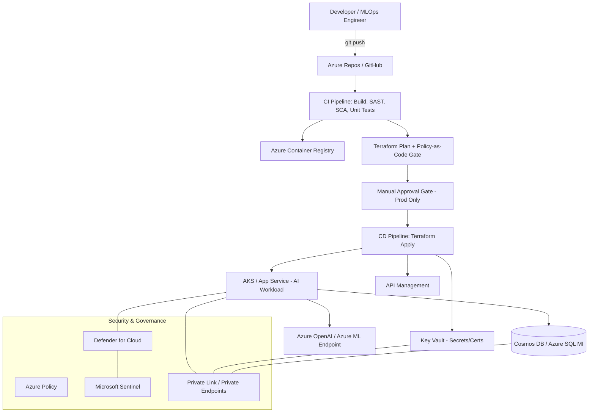

# Enterprise Deployment Architecture: AI-Powered Application on Azure with Secure CI/CD & Automated Infrastructure Provisioning

**Document Owner:** Prasenjit Chiney
**Version:** 1.0
**Audience:** Senior Cloud Architects, DevSecOps Engineers, Platform Engineering Leads

---

## 1. Executive Summary

This document defines the enterprise reference architecture, governance model, and operational runbook for deploying an AI-powered application on Microsoft Azure. It is written from the perspective of a principal-level cloud architect responsible for platform reliability, security posture, and cost governance across a regulated enterprise landscape.

The design goals are:

1. **Zero-touch, auditable deployments** via CI/CD.
2. **Infrastructure as Code (IaC)** as the single source of truth.
3. **Defense-in-depth security** across identity, network, data, and runtime layers.
4. **Repeatable, environment-parity provisioning** (Dev → Test → Staging → Prod).
5. **Full observability and compliance traceability** for audit and SRE purposes.

---

## 2. Solution Scope

| Component | Technology |
|---|---|
| AI Workload | Azure OpenAI Service / Azure Machine Learning endpoint |
| Application Tier | Azure App Service (Linux containers) / Azure Kubernetes Service (AKS) |
| API Gateway | Azure API Management (APIM) |
| Data Layer | Azure Cosmos DB / Azure SQL Managed Instance |
| Secrets & Keys | Azure Key Vault (HSM-backed) |
| IaC | Terraform (primary) with Bicep as alternate module set |
| CI/CD | Azure DevOps Pipelines (GitHub Actions as alternate) |
| Container Registry | Azure Container Registry (ACR) with content trust |
| Identity | Microsoft Entra ID (Workload Identity Federation, Managed Identities) |
| Security Posture | Microsoft Defender for Cloud, Azure Policy, Private Link |
| Observability | Azure Monitor, Application Insights, Log Analytics, Sentinel |

---

## 3. High-Level Architecture



---

## 4. Environment Strategy

| Environment | Purpose | Subscription | Approval Gate |
|---|---|---|---|
| Dev | Rapid iteration, feature branches | `sub-ai-dev` | None (auto-deploy) |
| Test/QA | Integration + regression testing | `sub-ai-test` | Automated quality gates only |
| Staging | Pre-prod, prod-like data (masked) | `sub-ai-stg` | 1 approver (Lead Engineer) |
| Production | Live workload | `sub-ai-prod` | 2 approvers (Eng Lead + Security) + change ticket |

Each environment is provisioned from the **same IaC module**, parameterized via `tfvars`/`bicepparam` files — never hand-edited. This guarantees environment parity and eliminates configuration drift.

---

## 5. Infrastructure as Code (IaC)

### 5.1 Repository Structure

```
infra/
├── modules/
│   ├── aks/
│   ├── apim/
│   ├── keyvault/
│   ├── networking/
│   ├── aoai/
│   └── monitoring/
├── environments/
│   ├── dev.tfvars
│   ├── test.tfvars
│   ├── staging.tfvars
│   └── prod.tfvars
├── main.tf
├── providers.tf
├── backend.tf
└── policy/
    └── conftest-rules/
```

### 5.2 Remote State & Locking

```hcl
terraform {
  backend "azurerm" {
    resource_group_name  = "rg-tfstate-prod"
    storage_account_name = "sttfstateaiapp"
    container_name        = "tfstate"
    key                    = "ai-app.${var.environment}.tfstate"
    use_azuread_auth       = true   # No storage account keys
  }
}
```

- State storage account has **soft delete, versioning, and immutability policy** enabled.
- Access restricted via **RBAC + Private Endpoint**, no shared keys (`use_azuread_auth`).

### 5.3 Sample Module Snippet — AKS with Workload Identity

```hcl
resource "azurerm_kubernetes_cluster" "aks" {
  name                = "aks-ai-${var.environment}"
  location            = var.location
  resource_group_name = azurerm_resource_group.rg.name
  dns_prefix          = "aksai${var.environment}"

  oidc_issuer_enabled       = true
  workload_identity_enabled = true

  default_node_pool {
    name                = "system"
    vm_size             = "Standard_D4s_v5"
    vnet_subnet_id      = azurerm_subnet.aks_subnet.id
    only_critical_addons_enabled = true
    auto_scaling_enabled = true
    min_count           = 3
    max_count           = 10
  }

  identity {
    type = "SystemAssigned"
  }

  network_profile {
    network_plugin    = "azure"
    network_policy    = "cilium"
    outbound_type     = "userDefinedRouting"
  }

  private_cluster_enabled = true
}
```

### 5.4 Policy-as-Code Gate

Before any `terraform apply`, the pipeline runs **Conftest / OPA** against the generated plan JSON to enforce guardrails such as:

- No public IPs on compute resources.
- All storage accounts must have `min_tls_version = TLS1_2` and public network access disabled.
- All Key Vaults must have `purge_protection_enabled = true`.
- All resources must carry mandatory tags (`CostCenter`, `DataClassification`, `Owner`).

---

## 6. CI/CD Pipeline Design

### 6.1 Pipeline Stages

1. **Source** — trunk-based development, protected `main` branch, mandatory PR review (2 reviewers, 1 must be CODEOWNER).
2. **Build & Unit Test** — compile, run unit tests, generate SBOM.
3. **Static Analysis** — SAST (CodeQL/Semgrep), secret scanning (Gitleaks/TruffleHog), dependency scanning (Dependabot/Snyk).
4. **Container Build** — multi-stage Dockerfile, distroless base image, image signed with **Notary v2 / cosign**.
5. **IaC Validation** — `terraform validate`, `tflint`, `conftest` policy gate.
6. **Deploy to Dev** — automatic.
7. **Integration & Model Evaluation Tests** — includes AI-specific checks: prompt regression tests, hallucination/quality thresholds, latency SLO checks.
8. **Deploy to Test/Staging** — automated with quality gates.
9. **Security Gate** — Defender for DevOps posture check, container CVE severity gate (block on Critical/High).
10. **Manual Approval** — Production only.
11. **Blue-Green / Canary Deploy to Production**.
12. **Post-Deploy Validation** — smoke tests, synthetic monitoring, automatic rollback trigger on SLO breach.

**Notes:**  The DevSecOps Guardrail (How it is used): This ties directly into the concept of automated pipeline guardrails. Generating the SBOM is the first step in Software Supply Chain Security. Here is how the flow usually works in an enterprise CI/CD pipeline:
Generate: The pipeline compiles the code and generates the SBOM JSON file.
Scan: An automated security tool (like Trivy, Grype, or Microsoft Defender for Cloud) ingests the SBOM and cross-references that "ingredients list" against global databases of known security vulnerabilities (CVEs).
Enforce: If the SBOM reveals that the build contains a critically vulnerable package (for example, an outdated version of Log4j), the security tool fails the build.
Just like OPA/Conftest blocks a bad terraform apply, the SBOM scan acts as a guardrail preventing known vulnerable code from ever reaching an Azure App Service or AKS cluster. If a new vulnerability is discovered months later, security teams can instantly query the SBOMs of all running applications to see exactly which workloads contain the compromised ingredient, rather than having to manually guess or decompile code.

**To generate** a standardized SBOM (in a format like SPDX or CycloneDX), you must explicitly define it as a step in your pipeline using specialized tooling.
Here is how enterprise environments typically handle this across different ecosystems.

**Approaches to Generating SBOMs** - The "Universal Scanners" (Recommended for CI/CD): 
Instead of configuring different plugins for React, Java, and Node, the modern DevSecOps approach uses a single universal CLI tool in the pipeline that scans the source directory or the final container image.
Industry-standard tools include:
Syft (by Anchore): Extremely fast, supports almost all languages, and outputs strictly formatted SBOMs.
Trivy (by Aqua Security): Can both generate the SBOM and instantly scan it for vulnerabilities.

### 6.2 Azure DevOps YAML (abridged)

```yaml
trigger:
  branches:
    include: [main]

variables:
  - group: ai-app-common-secrets   # backed by Key Vault linked variable group

stages:
- stage: Build
  jobs:
    - job: BuildAndScan
      pool: { vmImage: 'ubuntu-latest' }
      steps:
        - task: Docker@2
          inputs:
            command: build
            repository: $(ACR_REPO)
            tags: $(Build.BuildId)
        - script: |
            trivy image --severity CRITICAL,HIGH --exit-code 1 $(ACR_REPO):$(Build.BuildId)
          displayName: 'Container CVE Scan (fail on High/Critical)'
        - task: CodeQL3000Init@0
        - task: CodeQL3000Finalize@0

- stage: IaC_Validate
  dependsOn: Build
  jobs:
    - job: TerraformPlan
      steps:
        - script: terraform init -backend-config=environments/prod.backend.tfvars
        - script: terraform plan -var-file=environments/prod.tfvars -out=tfplan
        - script: terraform show -json tfplan > plan.json
        - script: conftest test plan.json -p policy/conftest-rules

- stage: DeployProd
  dependsOn: IaC_Validate
  condition: succeeded()
  jobs:
    - deployment: ProdDeploy
      environment: 'production-ai-app'   # Environment approvals + checks configured in ADO
      strategy:
        canary:
          increments: [10, 50, 100]
          deploy:
            steps:
              - script: terraform apply -auto-approve tfplan
              - script: ./scripts/smoke-test.sh
```

### 6.3 GitHub Actions Alternative — OIDC (No Stored Credentials)

```yaml
permissions:
  id-token: write
  contents: read

jobs:
  deploy:
    runs-on: ubuntu-latest
    steps:
      - uses: azure/login@v2
        with:
          client-id: ${{ secrets.AZURE_CLIENT_ID }}
          tenant-id: ${{ secrets.AZURE_TENANT_ID }}
          subscription-id: ${{ secrets.AZURE_SUBSCRIPTION_ID }}
          # Federated credential — no client secret stored anywhere
```

**Key principle:** No long-lived Service Principal secrets. All pipeline-to-Azure authentication uses **Workload Identity Federation (OIDC)**, eliminating a historically common breach vector.

---

## 7. Security Architecture (Defense-in-Depth)

### 7.1 Identity & Access

- **Zero standing privileged access** — Just-In-Time (JIT) elevation via Microsoft Entra Privileged Identity Management (PIM).
- Pipeline service connections use **federated Managed Identities**, scoped per environment with least-privilege RBAC roles (e.g., `AcrPush`, `Key Vault Secrets User` — never `Owner`/`Contributor` at subscription scope).
- Break-glass accounts stored offline, monitored via Sentinel alert on any use.

### 7.2 Network Security

- All PaaS services (Key Vault, ACR, Cosmos DB, Azure OpenAI, Storage) accessed exclusively via **Private Endpoints**; public network access disabled.
- **Hub-spoke topology** with Azure Firewall Premium (TLS inspection, IDPS) at the hub.
- AKS deployed as a **private cluster**; egress via User Defined Routes through the firewall only.
- Web Application Firewall (WAF) on Azure Front Door / APIM protecting all public-facing AI endpoints (OWASP Top 10 + custom rules for prompt-injection payload patterns).

### 7.3 Secrets & Key Management

- All secrets, API keys, and model connection strings reside in **Key Vault (Premium, HSM-backed)**.
- Applications retrieve secrets at runtime via **Managed Identity** — no secrets in code, pipeline variables, or config files.
- Automatic secret/certificate rotation with Event Grid–triggered rotation functions.
- Customer-managed keys (CMK) for encryption at rest on storage, Cosmos DB, and disks — supports BYOK compliance requirements.

### 7.4 AI-Specific Security Controls

- **Prompt injection / jailbreak filtering** via Azure AI Content Safety on both input and output.
- Data exfiltration controls: outbound network policy restricts model endpoints from calling arbitrary external URLs (tool/function-calling allow-list only).
- PII redaction pipeline before data reaches the model (Presidio or Azure AI Language PII detection).
- Model and prompt versions are immutable and tracked in a model registry for full lineage/audit.
- Rate limiting and token-quota enforcement at APIM layer to contain cost and abuse blast radius.

### 7.5 Governance & Compliance

- **Azure Policy initiatives** (e.g., NIST 800-53, ISO 27001, CIS Benchmark) assigned at Management Group level; non-compliant resources auto-remediated or denied at deploy time.
- **Microsoft Defender for Cloud** continuously assesses posture; Secure Score tracked as an SRE KPI.
- All administrative and pipeline actions logged to a centralized, immutable **Log Analytics workspace** with retention aligned to regulatory requirement (typically 1–7 years depending on data classification).
- **Microsoft Sentinel** correlates signals across identity, network, and application layers for threat detection, with SOAR playbooks for auto-containment (e.g., disable compromised identity, isolate node).

---

## 8. Observability & SRE

| Layer | Tooling | Key Signals |
|---|---|---|
| Application | Application Insights | Latency, error rate, dependency failures |
| AI Model | Custom telemetry + Azure Monitor | Token usage, latency, hallucination score, drift |
| Infrastructure | Azure Monitor, Container Insights | CPU/memory, pod restarts, node health |
| Security | Defender for Cloud, Sentinel | Anomalous access, policy violations, CVE exposure |
| Cost | Azure Cost Management + Budgets | Spend vs. budget, anomaly alerts |

- SLOs defined per service (e.g., P99 latency < 2s, availability ≥ 99.9%).
- Error-budget policy governs release velocity — burn-rate alerts can auto-pause the CD pipeline.

---

## 9. Disaster Recovery & Business Continuity

- **Multi-region active-passive** deployment (Primary: East US 2, DR: West US 2) using Azure Traffic Manager/Front Door failover.
- Infrastructure is redeployed to DR region via the same IaC pipeline (RTO target: < 1 hour).
- Data tier uses geo-redundant replication (Cosmos DB multi-region write or Azure SQL MI auto-failover groups); RPO target: < 15 minutes.
- Quarterly DR game-day exercises validate the runbook.

---

## 10. Case Continuation — Operational Runbook Highlights

This section continues the case narrative for handoff/on-call purposes:

1. **Incident detected** (SLO breach or Sentinel alert) → PagerDuty/Ops Genie triggers on-call.
2. **Triage** using Application Insights + Container Insights dashboards; check latest deployment marker (annotated automatically by CD pipeline).
3. **Automatic rollback** — if canary stage health checks fail, pipeline auto-reverts traffic weight to previous stable revision (blue-green swap) with zero manual intervention.
4. **Root cause captured** in a blameless post-incident review; action items tracked as backlog items with an owner and due date.
5. **Continuous improvement loop** — findings feed back into Conftest policy rules, alert thresholds, and chaos engineering test scenarios (Azure Chaos Studio) to prevent recurrence.

---

## 11. Appendix

### 11.1 Mandatory Tagging Standard
`Environment`, `Owner`, `CostCenter`, `DataClassification`, `Application`, `ChangeTicket`

### 11.2 Reference Links
- Azure Well-Architected Framework — AI Workloads
- Microsoft Cloud Adoption Framework — Enterprise-Scale Landing Zones
- NIST AI Risk Management Framework (AI RMF 1.0)

### 11.3 Change Log

| Version | Date | Author | Change |
|---|---|---|---|
| 1.0 | 2026-07-06 | Prasenjit Chiney | Initial enterprise release |

---

*End of Document*
